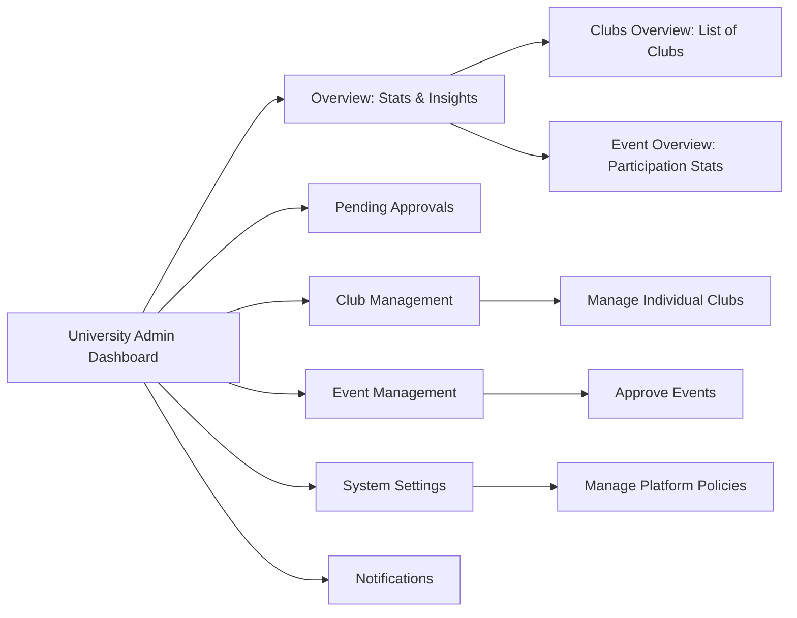
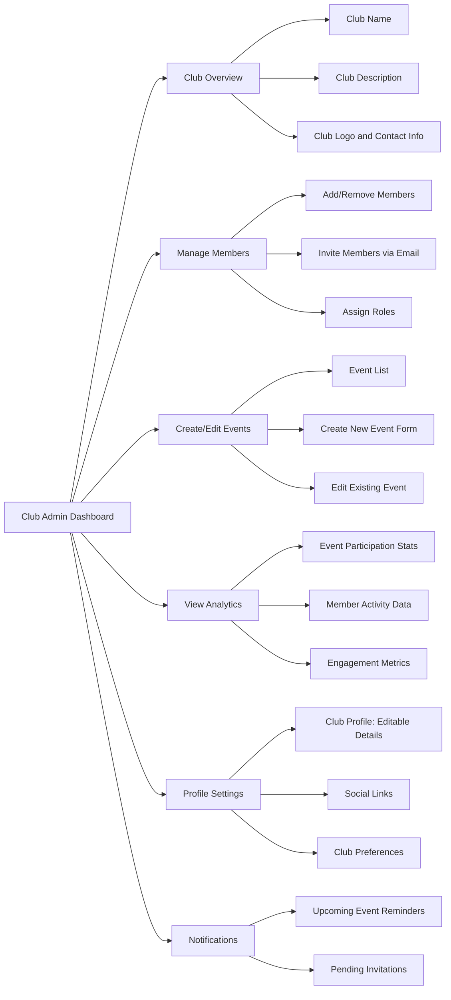
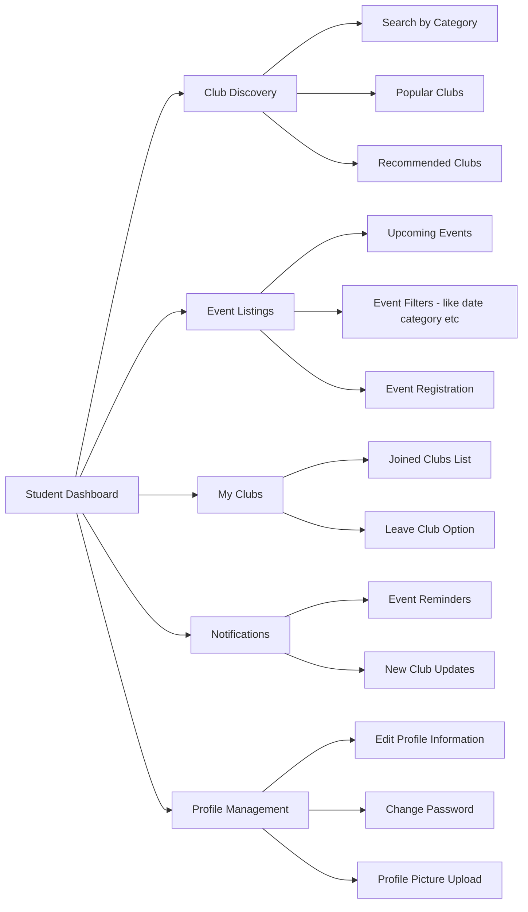
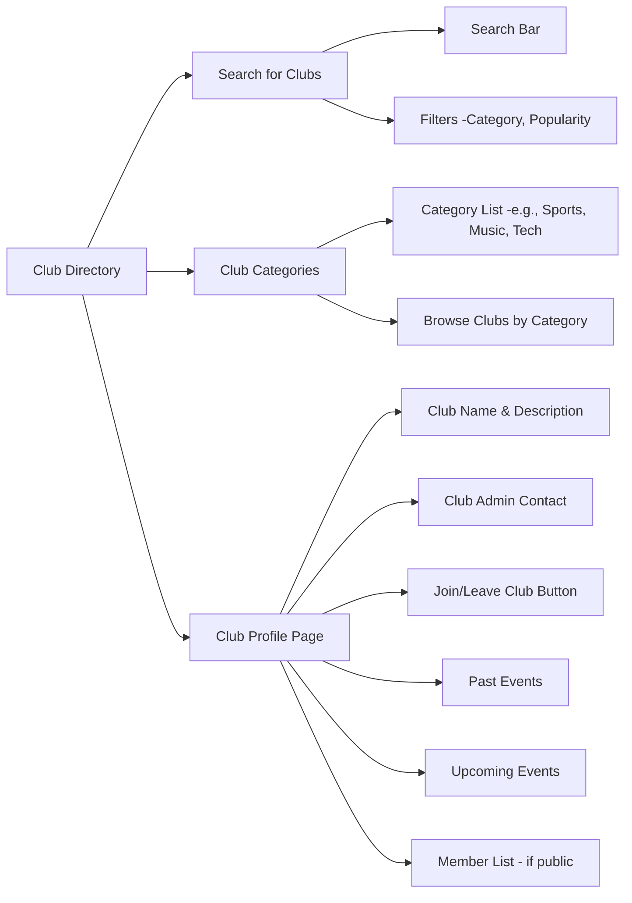
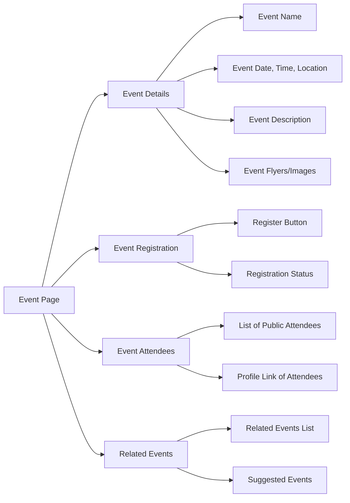
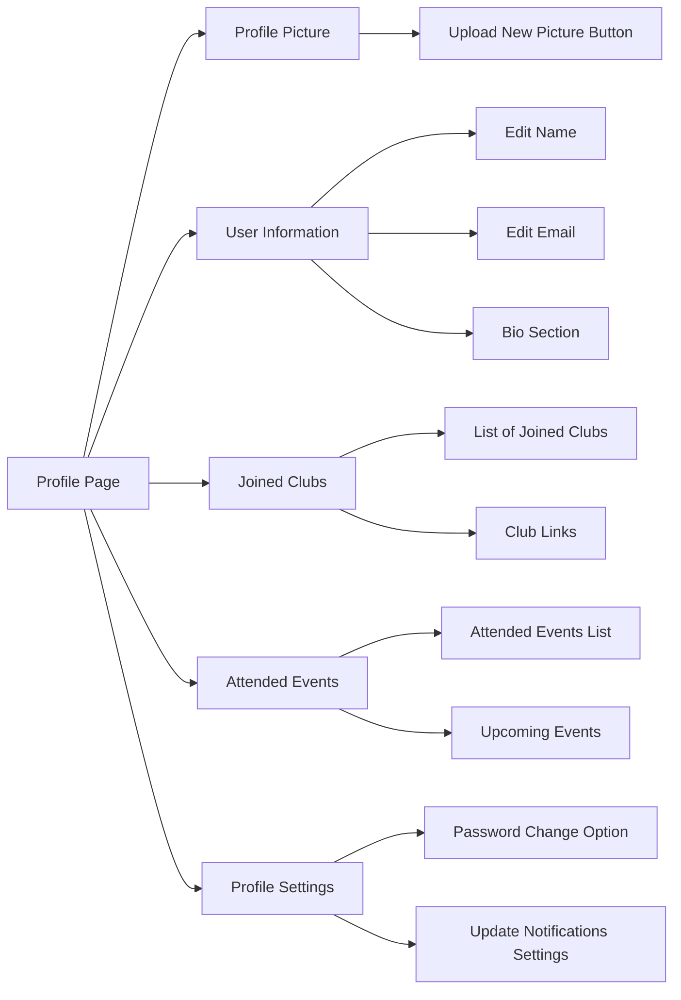

# University admin Dashboard

# Club admin Dashboard
### **Wireframe 2: Club Admin Dashboard**

#### Sections:

- **Club Overview**
- **Manage Members**
- **Event Creation/Edit**
- **Club Analytics**
- **Profile Settings**
- **Notifications**

### **Wireframe Layout Overview:**

1. **Club Overview**: At the top of the dashboard, there will be a small section for club information, including the club's name, description, logo, and contact details.
    
2. **Manage Members**: This section will include options for adding, removing, or inviting members. Admins can assign different roles to members (e.g., Event Manager, Club President) and manage permissions.
    
3. **Create/Edit Events**: Club admins can view existing events, create new ones, and edit past ones. This includes form fields like event name, date, time, location, and description. There will also be options for attaching flyers and other materials.
    
4. **Analytics**: This section gives club admins insights into club activity, event participation, and member engagement. Graphs and charts will make this data easy to digest.
    
5. **Profile Settings**: This area allows club admins to edit club profiles, update contact information, and manage the club's social links.
    
6. **Notifications**: Admins can receive reminders for upcoming events and notifications about pending member invitations.

# Student Dashboard
### **Wireframe 3: Student Dashboard**

#### Sections:

- **Club Discovery**
- **Event Listings**
- **My Clubs**
- **Notifications**
- **Profile Management**

### **Wireframe Layout Overview:**

1. **Club Discovery**:
    
    - A search bar allows students to search for clubs by name or category.
    - Popular and recommended clubs based on student interests and engagement will be displayed in card form, with a "Join Club" button for each.
2. **Event Listings**:
    
    - Shows upcoming events from all clubs.
    - Filters allow students to narrow down events by date, category, or club.
    - A "Register" button next to each event shows status (e.g., registered or not).
3. **My Clubs**:
    
    - Displays a list of clubs the student has joined, with the option to leave a club.
    - Clicking on a club takes them to the club’s profile page.
4. **Notifications**:
    
    - Notifications for upcoming events, new posts from clubs, and invites to events.
    - Allows students to manage notifications (e.g., turn off updates for specific clubs).
5. **Profile Management**:
    
    - Basic profile settings where students can update their information (name, bio, etc.).
    - Option to change the password and upload a profile picture.

# Club 
### **Wireframe 4: Club Directory/Club Page**

#### Sections:

- **Club Search**
- **Club Profile**
- **Join/Leave Club**
- **Past Events**
- **Club Admin Contact**

### **Wireframe Layout Overview:**

1. **Club Search**:
    
    - A search bar where students can enter club names or keywords.
    - Filters allow them to sort clubs by categories like sports, music, tech, and more.
2. **Club Profile**:
    
    - Contains the club’s name, description, and key details like meeting times, the number of members, and a contact form for reaching the club admin.
    - "Join/Leave Club" button based on the student's current membership status.
3. **Past Events**:
    
    - A section dedicated to displaying previous events, which gives new students a sense of the club's activities and engagements.
4. **Upcoming Events**:
    
    - Similar to past events, but focused on future dates with registration buttons.
5. **Club Admin Contact**:
    
    - Direct contact information for club admins for students interested in learning more.

# Event
### **Wireframe 5: Event Page**

#### Sections:

- **Event Details**
- **Event Registration**
- **Event Attendees (if public)**
- **Related Events**

### **Wireframe Layout Overview:**

1. **Event Details**:
    
    - The top of the page includes the event name, date, time, location, and description.
    - If the event has media (e.g., images or flyers), they will be displayed here.
2. **Event Registration**:
    
    - A button to register/unregister for the event, with a clear status indicator (e.g., "You are registered" or "Registration Closed").
3. **Event Attendees**:
    
    - If the event allows public attendee lists, students can view who is attending and click on profiles for further connection.
4. **Related Events**:
    
    - A list of similar or related events based on the student's interests or the clubs they have joined.

# Profile Page
### **Wireframe 6: Profile Page (for all user types)**

#### Sections:

- **Profile Picture**
- **User Information**
- **Joined Clubs**
- **Attended Events**
- **Profile Settings**

### **Wireframe Layout Overview:**

1. **Profile Picture**:
    
    - At the top, students can upload a profile picture. Club admins will also have similar functionality.
2. **User Information**:
    
    - Editable fields for name, email, and a short bio.
3. **Joined Clubs**:
    
    - A list of all clubs the user has joined, with quick links to the clubs’ pages.
4. **Attended Events**:
    
    - Displays a history of events attended, with filters for past and upcoming events.
5. **Profile Settings**:
    
    - Includes options to change the password, manage email notifications, and other profile settings.
