## Table of Contents

1. [Introduction](#introduction)
2. [System Overview](#system-overview)
3. [Key Components](#key-components) 
	1. 3.1 [University Admin Dashboard](#university-admin-dashboard) 
	2. 3.2 [Club Management Interface](#club-management-interface) 
	3. 3.3 [Student Portal](#student-portal) 
	4. 3.4 [Event Management System](#event-management-system) 
	5. 3.5 [Analytics and Reporting](#analytics-and-reporting) 
	6. 3.6 [Notification System](#notification-system) 
	7. 3.7 [Mobile App](#mobile-app) 
	8. 3.8 [Integration Hub](#integration-hub)
4. [Technical Architecture](#technical-architecture)
5. [User Workflows](#user-workflows)
6. [Development Roadmap](#development-roadmap)
7. [Challenges and Considerations](#challenges-and-considerations)
8. [Conclusion](#conclusion)

## 1. Introduction

The University Club Management System is a comprehensive web application designed to streamline the management of university clubs, enhance student engagement, and provide valuable insights to university administrators. This report outlines the system's structure, components, and implementation strategy.

## 2. System Overview

The system is structured as a centralized platform that serves three main user groups: university administrators, club administrators, and students. It provides tools for club creation, event management, member engagement, and analytics.

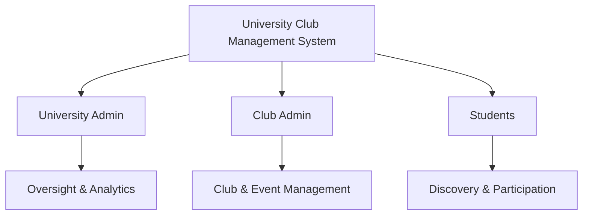
```mermaid
graph TD
    A[University Club Management System] --> B[University Admin]
    A --> C[Club Admin]
    A --> D[Students]
    B --> E[Oversight & Analytics]
    C --> F[Club & Event Management]
    D --> G[Discovery & Participation]
```

## 3. Key Components

### 3.1 University Admin Dashboard

The University Admin Dashboard serves as the control center for university officials to oversee all club activities, manage approvals, and access system-wide analytics.

**Key Features:**

- Overview of all clubs and their activities
- Analytics on student engagement
- Event calendar across all clubs
- Club approval queue

**Technology Stack:**

- Backend: Django
- Frontend: React
- Data Visualization: D3.js

**UI Reference:** Salesforce Higher Education Data Architecture

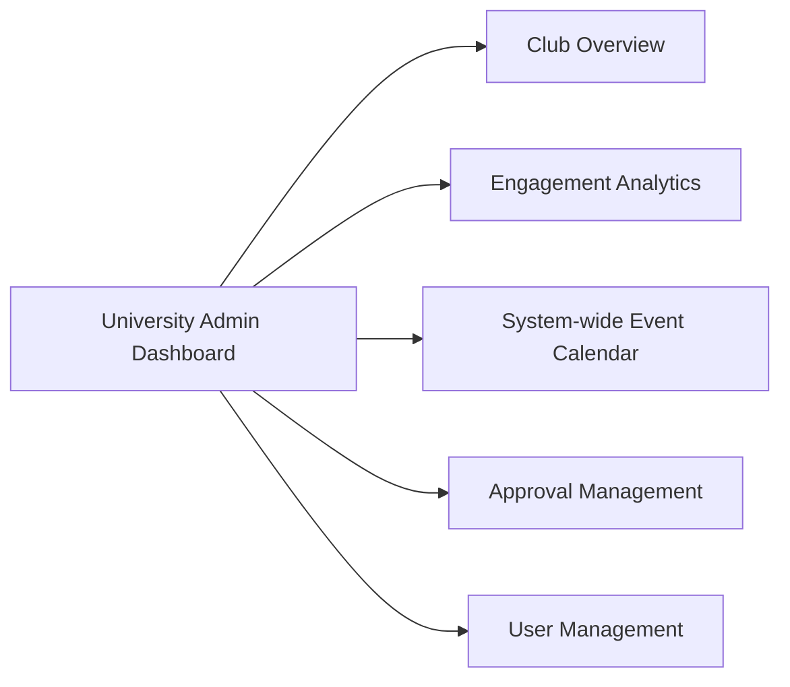
```mermaid 
graph LR
    A[University Admin Dashboard] --> B[Club Overview]
    A --> C[Engagement Analytics]
    A --> D[System-wide Event Calendar]
    A --> E[Approval Management]
    A --> F[User Management]


```

### 3.2 Club Management Interface

The Club Management Interface empowers club administrators to efficiently manage their club's activities, members, and events.

**Key Features:**

- Club creation and setup wizard
- Member management (roles, permissions)
- Event creation and management
- Discussion boards or chat channels

**Technology Stack:**

- Frontend: React with Redux
- Backend: Django REST Framework

**UI Reference:** Slack Workspace Management

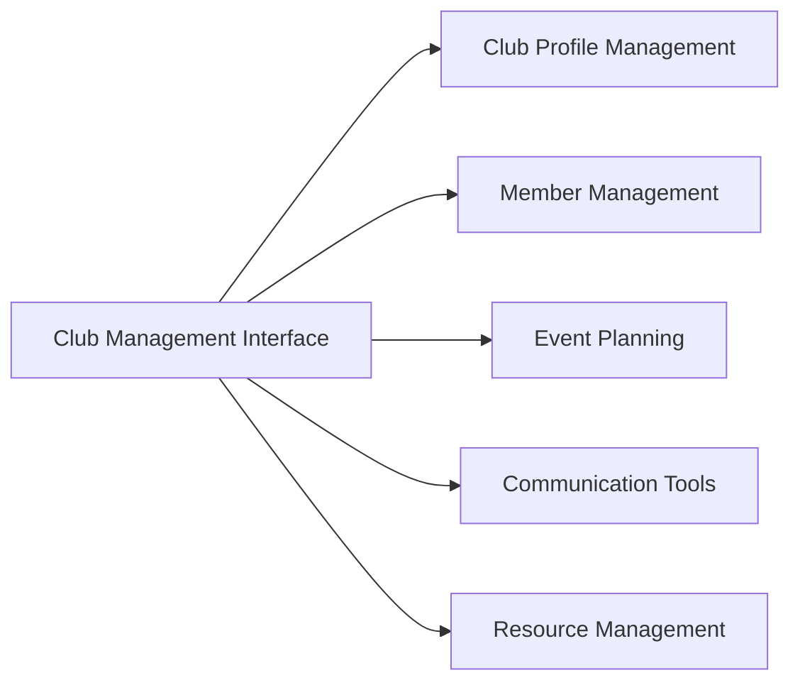
```mermaid
graph LR
    A[Club Management Interface] --> B[Club Profile Management]
    A --> C[Member Management]
    A --> D[Event Planning]
    A --> E[Communication Tools]
    A --> F[Resource Management]
```

### 3.3 Student Portal

The Student Portal serves as the main interface for students to discover clubs, register for events, and manage their club memberships.

**Key Features:**

- Club discovery (search, categories, recommendations)
- Event calendar and registration
- Personal profile management
- Club membership management

**Technology Stack:**

- Web: React
- Mobile: React Native

**UI Reference:** LinkedIn's interface for groups and events

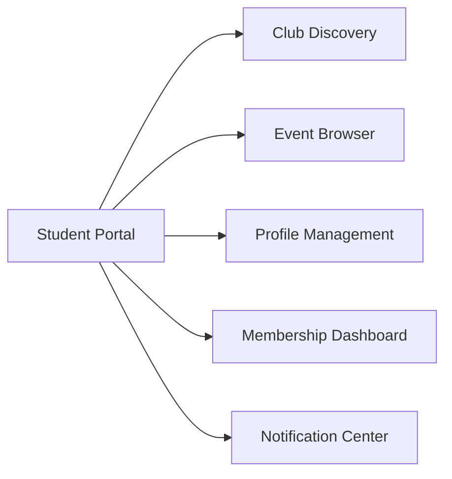
```mermaid
graph LR
    A[Student Portal] --> B[Club Discovery]
    A --> C[Event Browser]
    A --> D[Profile Management]
    A --> E[Membership Dashboard]
    A --> F[Notification Center]
```

### 3.4 Event Management System

The Event Management System facilitates the creation, promotion, and management of club events.

**Key Features:**

- Event creation wizard
- Attendee management
- Check-in system
- Post-event feedback collection

**Technology Stack:**

- Frontend: React
- Backend: Django with Celery for task management

**UI Reference:** Eventbrite's event creation and management tools

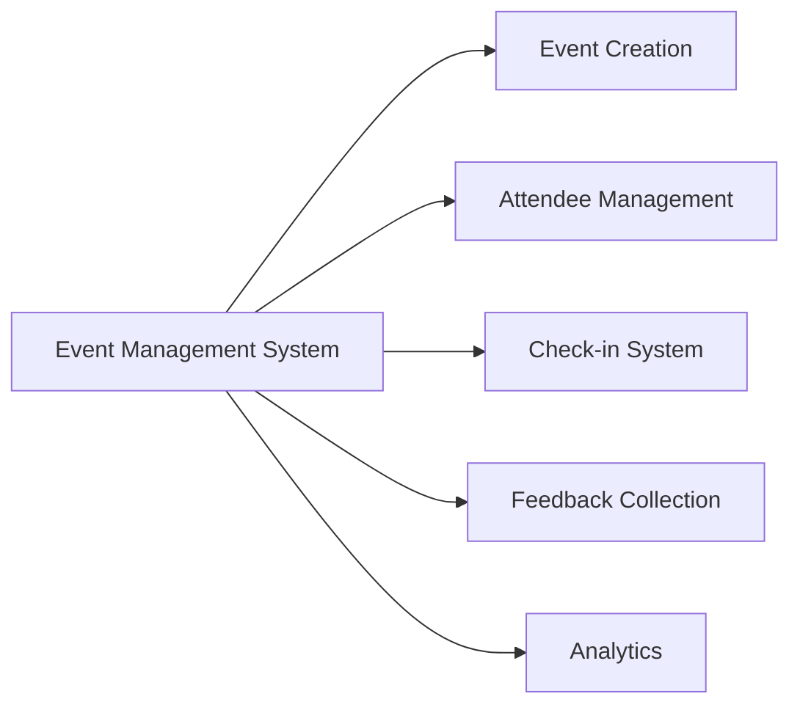
```mermaid
graph LR
    A[Event Management System] --> B[Event Creation]
    A --> C[Attendee Management]
    A --> D[Check-in System]
    A --> E[Feedback Collection]
    A --> F[Analytics]
```

### 3.5 Analytics and Reporting

The Analytics and Reporting module provides insights into club activities, student engagement, and system usage.

**Key Features:**

- User engagement metrics
- Event attendance analytics
- Club growth and activity reports
- Custom report builder

**Technology Stack:**

- Backend: Django with pandas for data processing
- Frontend: React with D3.js for data visualization

**UI Reference:** Google Analytics for Nonprofits

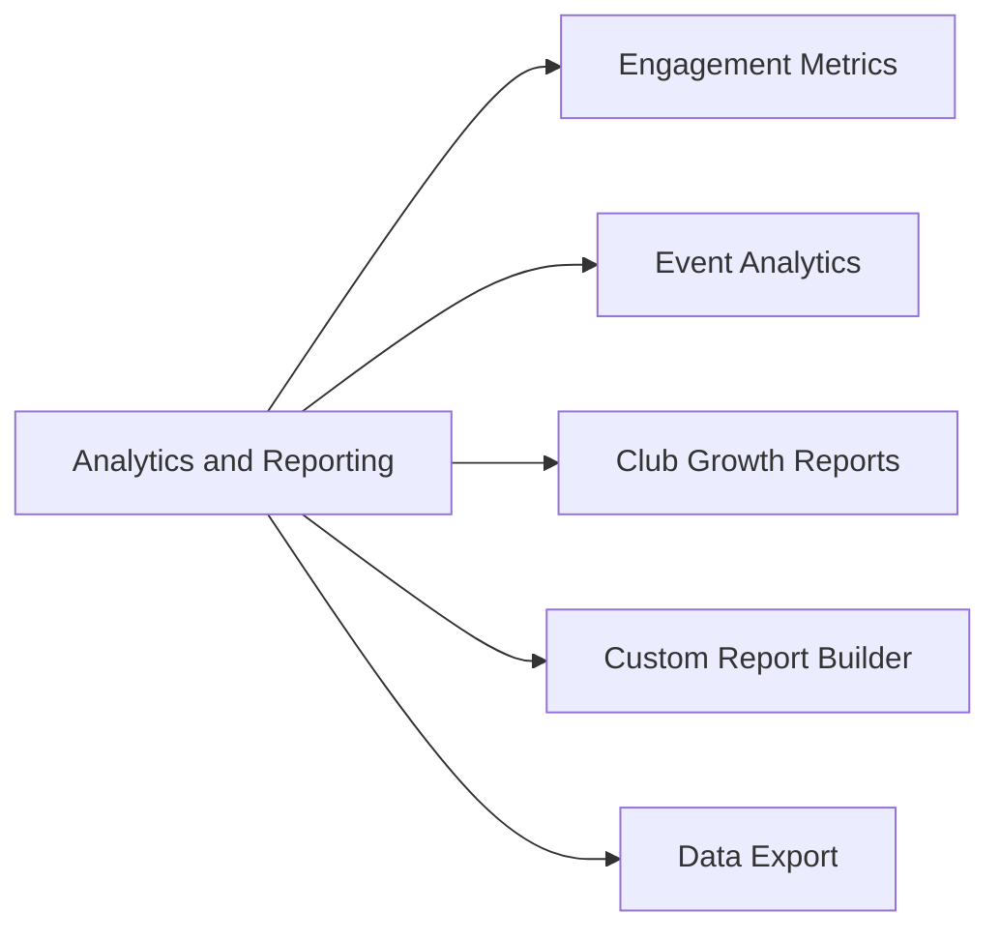
```mermaid
graph LR
    A[Analytics and Reporting] --> B[Engagement Metrics]
    A --> C[Event Analytics]
    A --> D[Club Growth Reports]
    A --> E[Custom Report Builder]
    A --> F[Data Export]
```

### 3.6 Notification System

The Notification System keeps all users informed about relevant updates and activities.

**Key Features:**

- Customizable notification preferences
- Multi-channel delivery (email, push, in-app)
- Notification center for history

**Technology Stack:**

- Backend: Django Channels for WebSockets
- Frontend: React
- Push Notifications: Firebase Cloud Messaging

**UI Reference:** Facebook's notification system

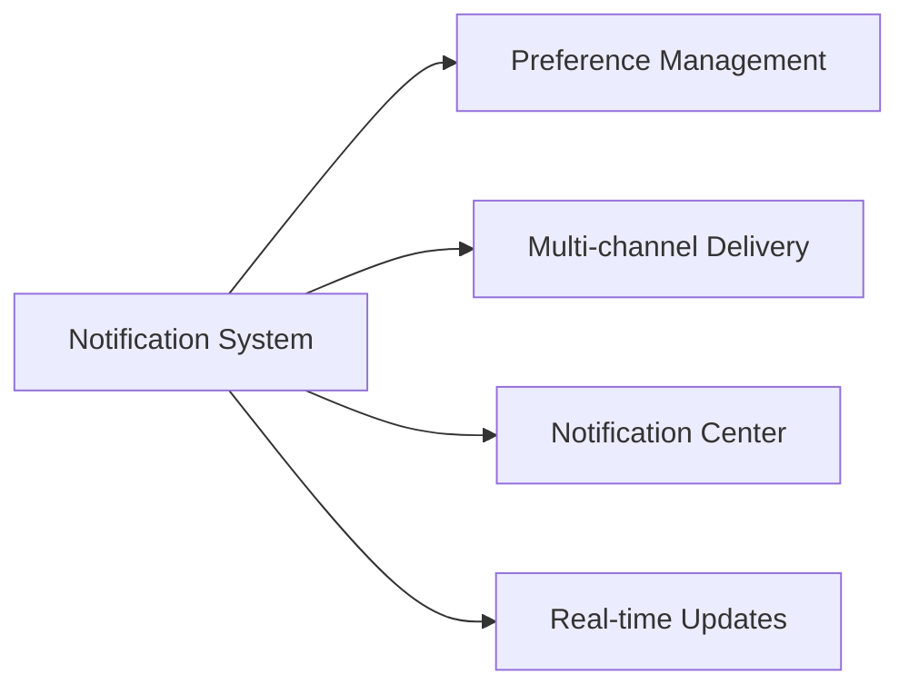
```mermaid
graph LR
    A[Notification System] --> B[Preference Management]
    A --> C[Multi-channel Delivery]
    A --> D[Notification Center]
    A --> E[Real-time Updates]

```

### 3.7 Mobile App

The Mobile App provides on-the-go access to key features of the University Club Management System.

**Key Features:**

- Club and event discovery
- Event check-ins
- Push notifications
- Offline access to key information

**Technology Stack:**

- React Native for cross-platform development
- Redux for state management

**UI Reference:** Meetup mobile app

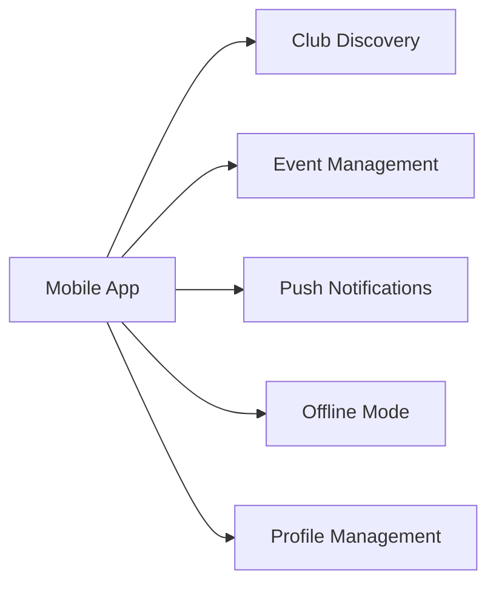
```mermaid
graph LR
    A[Mobile App] --> B[Club Discovery]
    A --> C[Event Management]
    A --> D[Push Notifications]
    A --> E[Offline Mode]
    A --> F[Profile Management]
```

### 3.8 Integration Hub

The Integration Hub allows for seamless connection with third-party services to enhance functionality.

**Key Features:**

- Calendar sync (Google Calendar, iCal)
- Social media sharing
- Document storage (Google Drive, Dropbox)
- Communication tools (Slack, Discord)

**Technology Stack:**

- Backend: Django
- Frontend: React
- Authentication: OAuth 2.0

**UI Reference:** Zapier's integration platform

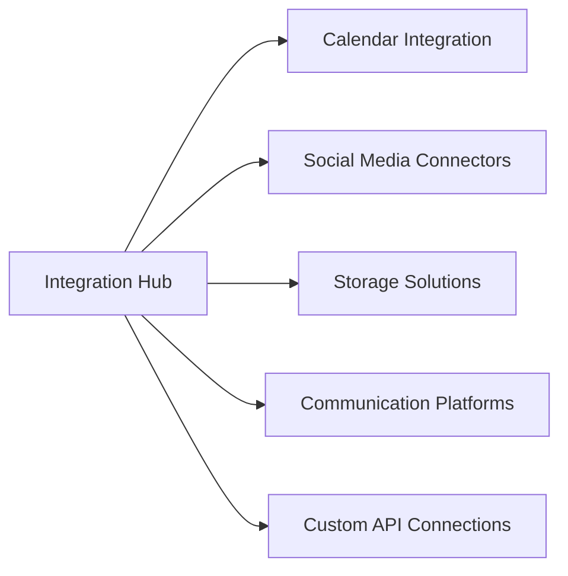
```mermaid
graph LR
    A[Integration Hub] --> B[Calendar Integration]
    A --> C[Social Media Connectors]
    A --> D[Storage Solutions]
    A --> E[Communication Platforms]
    A --> F[Custom API Connections]
```

## 4. Technical Architecture

The system follows a microservices architecture to ensure scalability and maintainability.

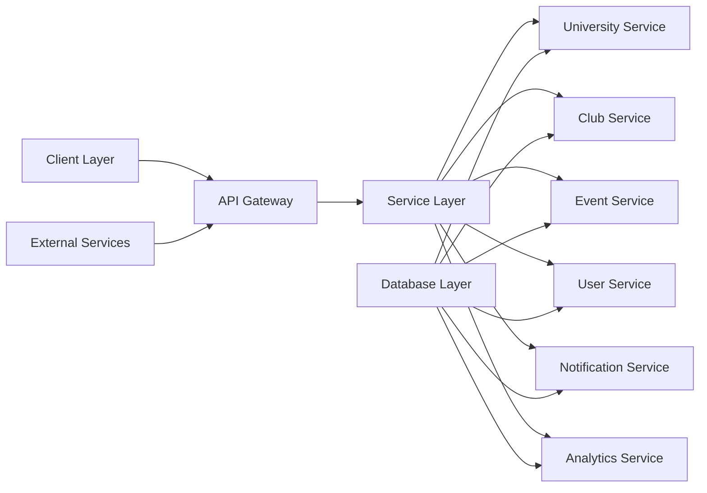
```mermaid
graph LR
    A[Client Layer] --> B[API Gateway]
    B --> C[Service Layer]
    C --> D[University Service]
    C --> E[Club Service]
    C --> F[Event Service]
    C --> G[User Service]
    C --> H[Notification Service]
    C --> I[Analytics Service]
    J[Database Layer] --> D
    J --> E
    J --> F
    J --> G
    J --> H
    J --> I
    K[External Services] --> B
```

**Key Technologies:**

- Backend: Django, Django REST Framework
- Frontend: React, React Native
- Database: PostgreSQL
- Caching: Redis
- Message Queue: RabbitMQ
- Search: Elasticsearch
- Containerization: Docker
- Orchestration: Kubernetes
- CI/CD: Jenkins

## 5. User Workflows

### University Admin Workflow

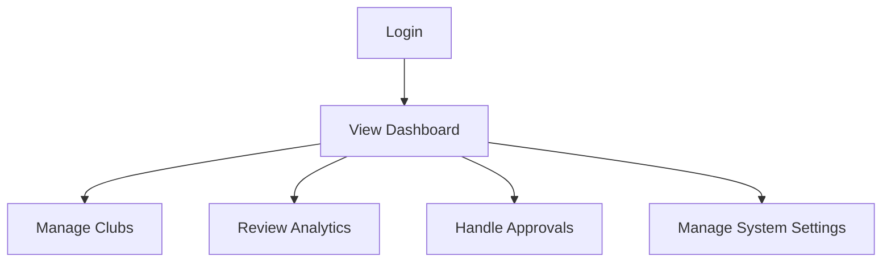
```mermaid
graph TD
    A[Login] --> B[View Dashboard]
    B --> C[Manage Clubs]
    B --> D[Review Analytics]
    B --> E[Handle Approvals]
    B --> F[Manage System Settings]
```

### Club Admin Workflow

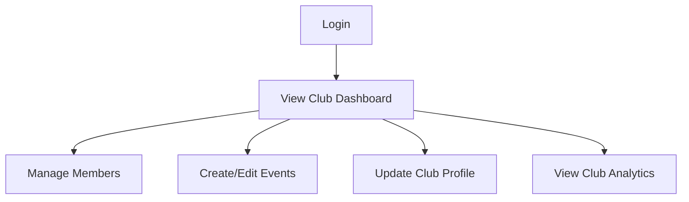
```mermaid
graph TD
    A[Login] --> B[View Club Dashboard]
    B --> C[Manage Members]
    B --> D[Create/Edit Events]
    B --> E[Update Club Profile]
    B --> F[View Club Analytics]
```

### Student Workflow

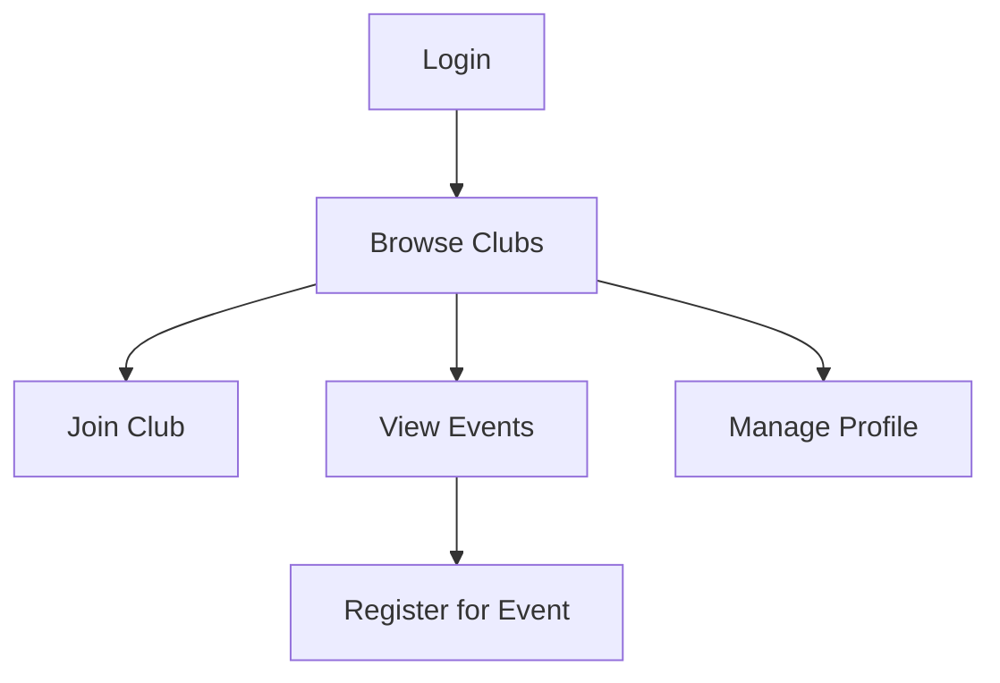
```mermaid
graph TD
    A[Login] --> B[Browse Clubs]
    B --> C[Join Club]
    B --> D[View Events]
    D --> E[Register for Event]
    B --> F[Manage Profile]
```

## 6. Development Roadmap

1. **Phase 1: Core Functionality** (3 months)
    - Develop basic user authentication
    - Create university and club management interfaces
    - Implement event creation and management
2. **Phase 2: Student Engagement** (2 months)
    - Develop student portal
    - Implement club discovery and event registration
    - Create basic notification system
3. **Phase 3: Analytics and Reporting** (2 months)
    - Implement data collection mechanisms
    - Develop analytics dashboard
    - Create custom report builder
4. **Phase 4: Mobile App Development** (3 months)
    - Develop React Native mobile app
    - Implement offline functionality
    - Integrate push notifications
5. **Phase 5: Integrations and Enhancements** (2 months)
    - Develop integration hub
    - Implement third-party service connections
    - Enhance system based on user feedback
6. **Phase 6: Testing and Deployment** (2 months)
    - Conduct thorough system testing
    - Perform security audits
    - Deploy to production environment

## 7. Challenges and Considerations

1. **Data Privacy and Security:** Ensuring compliance with data protection regulations (e.g., GDPR, CCPA).
2. **Scalability:** Designing the system to handle growth in users, clubs, and data volume.
3. **User Adoption:** Encouraging consistent use among students and club administrators.
4. **Integration Complexity:** Managing connections with various third-party services.
5. **Mobile-Web Parity:** Ensuring consistent functionality between web and mobile platforms.
6. **Performance Optimization:** Maintaining quick response times, especially for mobile users.
7. **Accessibility:** Ensuring the system is usable by people with disabilities.

## 8. Conclusion

The University Club Management System offers a comprehensive solution to streamline club activities, enhance student engagement, and provide valuable insights to university administrators. By leveraging modern technologies and user-friendly interfaces, this system has the potential to significantly improve the club experience for all stakeholders in the university ecosystem.

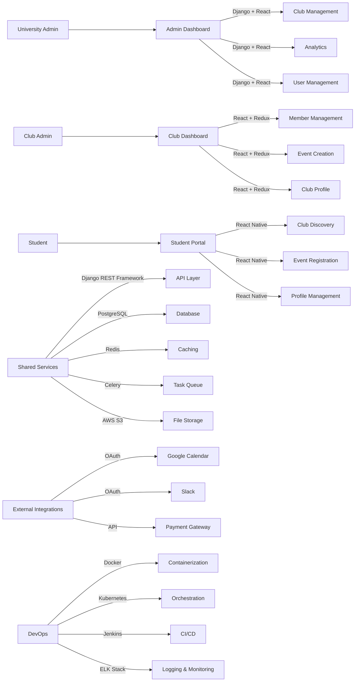
```mermaid
graph LR
    A[University Admin] --> B[Admin Dashboard]
    B --> |Django + React| C[Club Management]
    B --> |Django + React| D[Analytics]
    B --> |Django + React| E[User Management]

    F[Club Admin] --> G[Club Dashboard]
    G --> |React + Redux| H[Member Management]
    G --> |React + Redux| I[Event Creation]
    G --> |React + Redux| J[Club Profile]

    K[Student] --> L[Student Portal]
    L --> |React Native| M[Club Discovery]
    L --> |React Native| N[Event Registration]
    L --> |React Native| O[Profile Management]

    P[Shared Services]
    P --> |Django REST Framework| Q[API Layer]
    P --> |PostgreSQL| R[Database]
    P --> |Redis| S[Caching]
    P --> |Celery| T[Task Queue]
    P --> |AWS S3| U[File Storage]

    V[External Integrations]
    V --> |OAuth| W[Google Calendar]
    V --> |OAuth| X[Slack]
    V --> |API| Y[Payment Gateway]

    Z[DevOps]
    Z --> |Docker| AA[Containerization]
    Z --> |Kubernetes| AB[Orchestration]
    Z --> |Jenkins| AC[CI/CD]
    Z --> |ELK Stack| AD[Logging & Monitoring]

```

university club management system

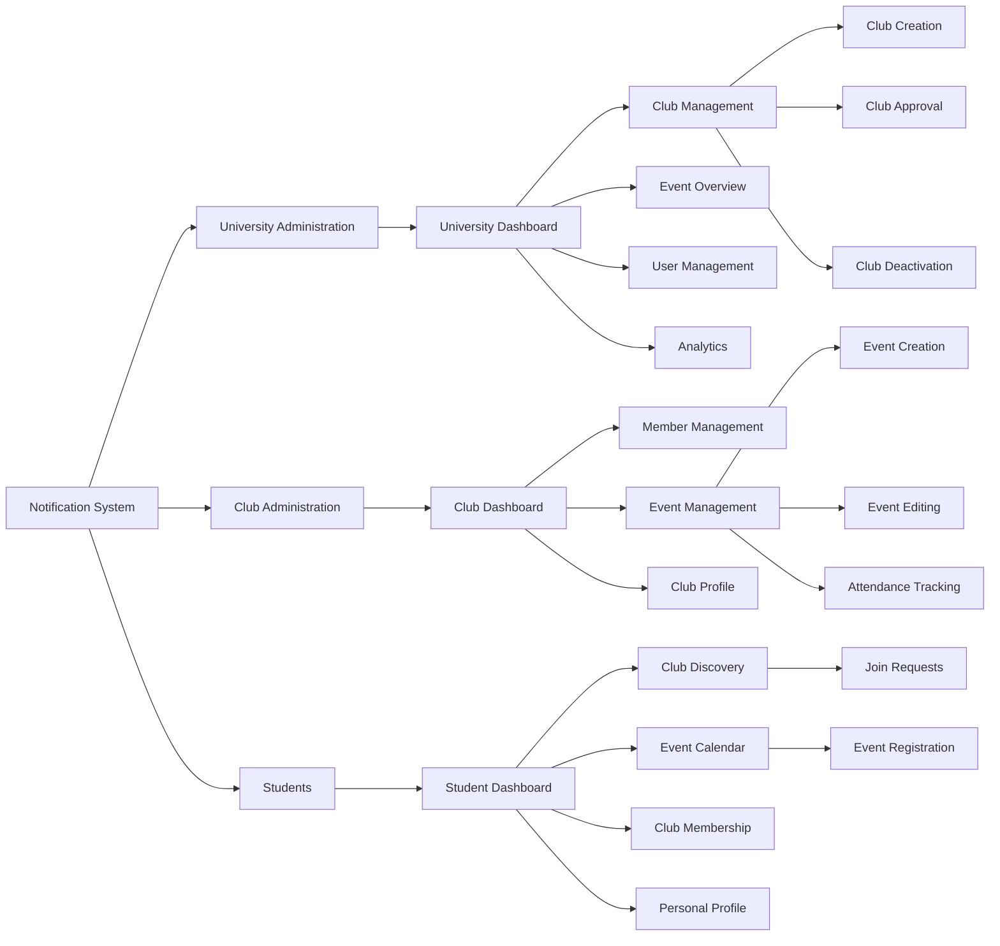
```mermaid
graph LR
    A[University Administration] --> B[University Dashboard]
    B --> C[Club Management]
    B --> D[Event Overview]
    B --> E[User Management]
    B --> F[Analytics]

    C --> G[Club Creation]
    C --> H[Club Approval]
    C --> I[Club Deactivation]

    J[Club Administration] --> K[Club Dashboard]
    K --> L[Member Management]
    K --> M[Event Management]
    K --> N[Club Profile]

    O[Students] --> P[Student Dashboard]
    P --> Q[Club Discovery]
    P --> R[Event Calendar]
    P --> S[Club Membership]
    P --> T[Personal Profile]

    M --> U[Event Creation]
    M --> V[Event Editing]
    M --> W[Attendance Tracking]

    Q --> X[Join Requests]
    R --> Y[Event Registration]

    Z[Notification System] --> A
    Z --> J
    Z --> O
```

# Web Application Structure for University Club Management

## 1. Backend Structure
- Framework: Django (Python)
- Database: PostgreSQL

### Main Django Apps:
1. **accounts**
   - User model (AbstractUser)
   - Authentication views
   - User profiles

2. **universities**
   - University model
   - University admin views

3. **clubs**
   - Club model
   - Club management views

4. **events**
   - Event model
   - Event creation and management views

5. **dashboard**
   - Views for different user dashboards

## 2. Frontend Structure
- Framework: React.js
- State Management: Redux

### Main Components:
1. **Layout**
   - Header
   - Footer
   - Navigation

2. **Authentication**
   - Login
   - Registration
   - Password Reset

3. **Dashboards**
   - University Admin Dashboard
   - Club Admin Dashboard
   - Student Dashboard

4. **Club Management**
   - Club Creation
   - Club Editing
   - Member Management

5. **Event Management**
   - Event Creation
   - Event Editing
   - Event Calendar

6. **User Profile**
   - Profile View
   - Profile Editing

## 3. API Structure
- RESTful API using Django REST Framework

### Endpoints:
1. `/api/auth/` - Authentication endpoints
2. `/api/universities/` - University management
3. `/api/clubs/` - Club management
4. `/api/events/` - Event management
5. `/api/users/` - User profile management

## 4. Database Schema
1. User
2. University
3. Club
4. Event
5. Membership (for club members)
6. EventAttendance

## 5. Additional Features
- Real-time notifications using WebSockets
- File upload for club logos and event posters
- Search functionality
- Analytics dashboard

# Detailed Technical Stack for University Club Management System (Mobile Web Focus)

## 1. Frontend Technologies

### Core:

- HTML5
- CSS3
- JavaScript (ES6+)

### Frontend Framework:

- React.js
    - Reason: Efficient for building interactive UIs, great for single-page applications (SPAs)

### State Management:

- Redux
    - Reason: Manages complex state across the application

### UI Component Library:

- Material-UI or Tailwind CSS
    - Reason: Provides pre-built, customizable components with built-in responsiveness

### Responsive Design:

- CSS Grid
- Flexbox
- Media Queries

### Progressive Web App (PWA) Technologies:

- Service Workers
- Web App Manifest
    - Reason: Enables offline functionality and app-like experience on mobile devices

## 2. Backend Technologies

### Core:

- Python 3.x

### Web Framework:

- Django
    - Reason: Robust, secure, and scalable framework with built-in admin interface

### API Framework:

- Django REST Framework
    - Reason: Powerful and flexible toolkit for building Web APIs

### Asynchronous Task Queue:

- Celery
    - Reason: Handles background tasks and scheduled jobs efficiently

### WebSocket Support:

- Django Channels
    - Reason: Enables real-time features like notifications

## 3. Database

### Primary Database:

- PostgreSQL
    - Reason: Robust, scalable, and supports complex queries

### Caching:

- Redis
    - Reason: In-memory data structure store, used for caching and as a message broker

## 4. Authentication and Authorization

- Django's built-in authentication system
- JSON Web Tokens (JWT) for API authentication

## 5. Search Functionality

- Elasticsearch
    - Reason: Provides fast, scalable full-text search capabilities

## 6. File Storage

- Amazon S3 or Django's FileField
    - Reason: Efficient storage and serving of user-uploaded files

## 7. Development Tools

### Version Control:

- Git

### Package Managers:

- npm (for frontend packages)
- pip (for Python packages)

### Build Tools:

- Webpack (included with Create React App)
- Babel (for JavaScript transpilation)

### Linting and Formatting:

- ESLint (JavaScript)
- Black (Python)

## 8. Testing

### Frontend Testing:

- Jest
- React Testing Library

### Backend Testing:

- Django Test Framework
- pytest

## 9. Performance Optimization

- Lazy loading of images and components
- Code splitting in React
- CDN for static asset delivery

## 10. Monitoring and Analytics

- Sentry (for error tracking)
- Google Analytics or Matomo (for user analytics)

## 11. Deployment and DevOps

### Containerization:

- Docker

### Continuous Integration/Continuous Deployment (CI/CD):

- GitLab CI or Jenkins

### Hosting:

- Heroku or DigitalOcean (for easier initial deployment)
- AWS or Google Cloud Platform (for more advanced scaling needs)

### Server:

- Gunicorn (WSGI HTTP Server)
- Nginx (as reverse proxy)

## 12. Security

- Django's built-in security features
- SSL/TLS certificates (Let's Encrypt)
- Regular security audits and penetration testing tools

## 13. API Documentation

- Swagger/OpenAPI
    - Reason: Provides interactive documentation for your API

## 14. Responsive Design Testing Tools

- Browser DevTools
- BrowserStack (for testing on multiple real devices)

## 15. Performance Testing

- Lighthouse (built into Chrome DevTools)
- WebPageTest for more detailed analysis

This technical stack is optimized for building a responsive web application that performs well on mobile devices. It leverages Django's robustness on the backend with React's flexibility on the frontend, while incorporating tools and technologies that enhance mobile web performance and user experience.

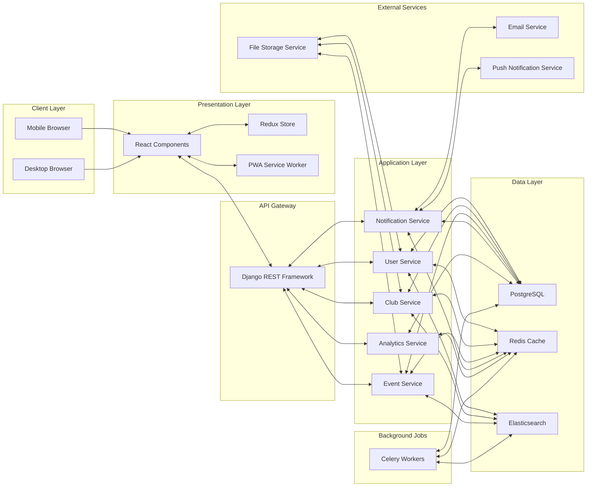
```mermaid
	graph LR
    subgraph "Client Layer"
        A[Mobile Browser]
        B[Desktop Browser]
    end

    subgraph "Presentation Layer"
        C[React Components]
        D[Redux Store]
        E[PWA Service Worker]
    end

    subgraph "API Gateway"
        F[Django REST Framework]
    end

    subgraph "Application Layer"
        G[User Service]
        H[Club Service]
        I[Event Service]
        J[Notification Service]
        K[Analytics Service]
    end

    subgraph "Background Jobs"
        L[Celery Workers]
    end

    subgraph "Data Layer"
        M[PostgreSQL]
        N[Redis Cache]
        O[Elasticsearch]
    end

    subgraph "External Services"
        P[Email Service]
        Q[Push Notification Service]
        R[File Storage Service]
    end

    A --> C
    B --> C
    C <--> D
    C <--> E
    C <--> F
    F <--> G
    F <--> H
    F <--> I
    F <--> J
    F <--> K
    G <--> M
    H <--> M
    I <--> M
    J <--> M
    K <--> M
    G <--> N
    H <--> N
    I <--> N
    J <--> N
    K <--> N
    G <--> O
    H <--> O
    I <--> O
    L <--> M
    L <--> N
    L <--> O
    J <--> P
    J <--> Q
    R <--> G
    R <--> H
    R <--> I
```
